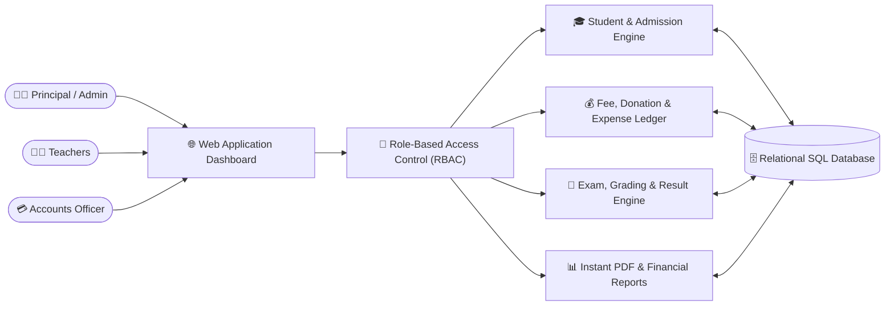

# 🏫 Madrasah Management SaaS (Institutional ERP)

**A comprehensive, full-stack institutional ERP and educational management platform engineered for Madrasahs and modern academic institutions.**

  
  
  

---

## 🌟 Executive Overview

**Madrasah Management SaaS** digitizes the entire administrative, financial, and academic lifecycle of educational institutions. Designed with a clean, intuitive bilingual interface (Bengali & English), it replaces error-prone paper registers with real-time financial ledgers, automated student fee tracking, exam grading engines, and role-based dashboards.

---

## 🏗️ System Architecture

---

## ⚡ Core Modules & Capabilities

| Module | Key Features |
| :--- | :--- |
| **🎓 Student Information System** | Digital admission forms, department/jamat allocation, guardian profiling, ID card generation, and attendance tracking. |
| **💰 Automated Financial & Fee Ledger** | Monthly tuition collection, due tracking (`Paid`/`Unpaid` filters), donor/lillah fund accounting, teacher payroll, and daily cashbook reconciliation. |
| **📝 Academic & Exam Management** | Custom syllabus configuration, subject-wise mark entry, automated GPA/division calculation, and printable mark sheets. |
| **📊 Real-Time Executive Dashboard** | Instant visibility into monthly collections, pending dues, expense breakdowns, and student demographics. |

---

## 👨‍💻 Architected By

**Jubayer Ahamed**  
*AI Automation & Software Solutions Specialist | Founder @ [Be Smart With AI](https://www.facebook.com/besmartwithaipro)*

- 💬 **WhatsApp Direct:** [+880 1610-594042](https://wa.me/8801610594042)
- 🌐 **Facebook Page:** [Be Smart With AI](https://www.facebook.com/besmartwithaipro)
- 📧 **Email:** [sbmc4042@gmail.com](mailto:sbmc4042@gmail.com)
